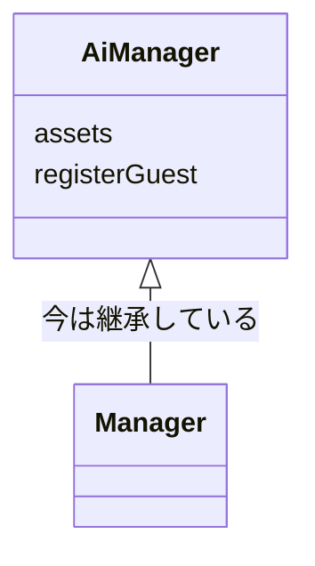

# HINTS.md の形式

## 全体

```markdown
# クラス設計の見直しヒント

最終チェック：2026-10-13（合格チェック 1回目）
レベル：初学者

## 合格チェックの結果
（初回レビュー時は全ヒントを「未着手」で作っておく）

| ヒント | 内容 | 判定 |
| --- | --- | --- |
| 1 | 継承をやめる | 合格 |
| 3 | 客に状態を持たせる | もう少し |
| 4 | Menu を整理する | 未着手 |

## 今回の進み具合
（合格チェック時のみ。できたことを具体的に1〜2行、次のおすすめを1つ）

## まずはここから：読み方と進める順番
（答えのコードは書いていないこと、TODO は自分で埋めること、おすすめの順番とその理由を短く）

## ヒント3：〜〜
…

## 合格したヒント
（見出しと合格日だけ残す。例：ヒント1：太郎は管理者の一種ではないので、継承をやめてみよう（2026-10-13 合格））

## 取り下げたヒント
（作り替えで対象がなくなったヒントを、見出し・日付・理由だけ残す。例：ヒント5：〜〜（2026-10-20 取り下げ：DVD クラスを作り直し、日数の管理がなくなったため））

## チェック履歴
- 2026-10-06 初回レビュー：ヒント9個
- 2026-10-13 合格チェック：合格1・もう少し1・未着手7・取り下げ0・新規0
- 2026-10-20 合格チェック：合格2・もう少し3・未着手2・取り下げ1・新規1（ヒント10）
- 2026-10-27 新規レビュー：ヒント7個（これまでの合格5個は「これまでに合格したヒント」に残す）
```

## 判定を書き込んだチェック項目の例

```markdown
**できたかチェック**

- [x] `extends` なしで、太郎がログインして在庫や売上を見られる（`Shop.java:24`、実行して確認）
- [x] 社員クラスに「資産」のフィールドがない（`Employee.java`）
- [ ] `instanceof` なしで権限を判定できている
  → `Shop.java:41` にまだ `instanceof` が残っています。権限は社員のどのフィールドを見れば判定できそうですか？
```

## バグのヒントに残す再現用の入力

合格チェックで同じ入力を流して確かめるため、実際のバグのヒントには再現手順と一緒に入力を残す。学生が読み飛ばせるよう `<details>` に入れる。

````markdown
<details>
<summary>確認用の入力（合格チェックで使います）</summary>

```text
太郎
4
YES
1
1
7
7
7
2
1
8
太郎
1000
2
5
9
```

</details>
````

## 1つのヒントの形

重要なヒント（設計の根っこ、実際のバグ）は次の構成で厚めに書く。軽いヒント（命名、小さな整理）は、説明・コード例・チェックだけの短い形にする。全部を同じ厚さにしない。

```markdown
## ヒント1：太郎は管理者の一種ではないので、継承をやめてみよう

（今どうなっているか。ファイル:行 を添えて2〜3文。学生自身のメモやコメントに違和感が書かれていれば拾う）

（実際のバグなら、自分の目で確かめる再現手順を番号付きで）

（構造の問題なら Mermaid のクラス図で「今」と「直したあと」を並べる。下記）

**考えてみてほしいこと**

1. （答えに気づける問いを2〜5個。現実のたとえ、声に出して読むテスト、「変更が入ったら何か所直す？」が効く）

**手を動かすきっかけ**

（直す手順を日本語で2〜4ステップ。どのファイルのどこから手を付けるか、どの順に進めるか。「何をするか」まで書き、「どう書くか」は骨組みの TODO に残す）

1. （例：まず `GuestStatus` の enum を作る）
2. （例：`Guest` に状態のフィールドと、状態を変えるメソッドを用意する）
3. （例：`EndDay.java:44` と `ReturnMenu.java:55` で客を作り直している所を、そのメソッドを呼ぶ形に変える）

（骨組みのコード。ロジックは // TODO。今のコードとの見比べ例はあってよい）

**できたかチェック**

- [ ] （コードを見て判定できる項目。「理解した」のような判定できない項目は書かない）
```

## クラス図

構造に関わるヒント（継承、責務、状態の持ち方、新しいクラスの導入）では、Mermaid の `classDiagram` を使う。GitHub と、Mermaid 対応の拡張を入れた VS Code のプレビューで図として表示される。



- 「今」と「直したあと」は、別々の図にして続けて並べる。
- 直したあとの図に書くのは、ヒントで示した骨組みの範囲まで。それより先は答えになるので描かない。

## コード例の書き方

- 骨組みはコンパイルできる形にこだわらなくてよいが、文法としては正しく書く（enum の定数のあとの `;` など）。
- 今のコードを引用するときは、該当箇所だけを数行で。
- 調べてほしい API やキーワードは、使い方を書かずに名前だけ示す（例：「`List.copyOf` を調べてみてください」）。
